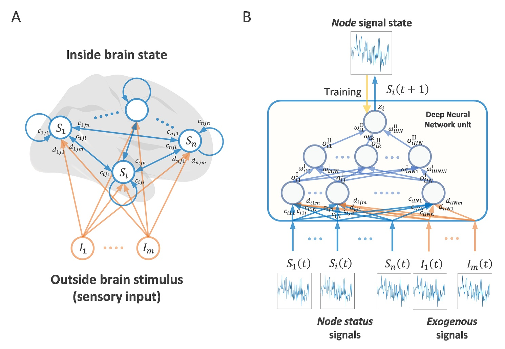
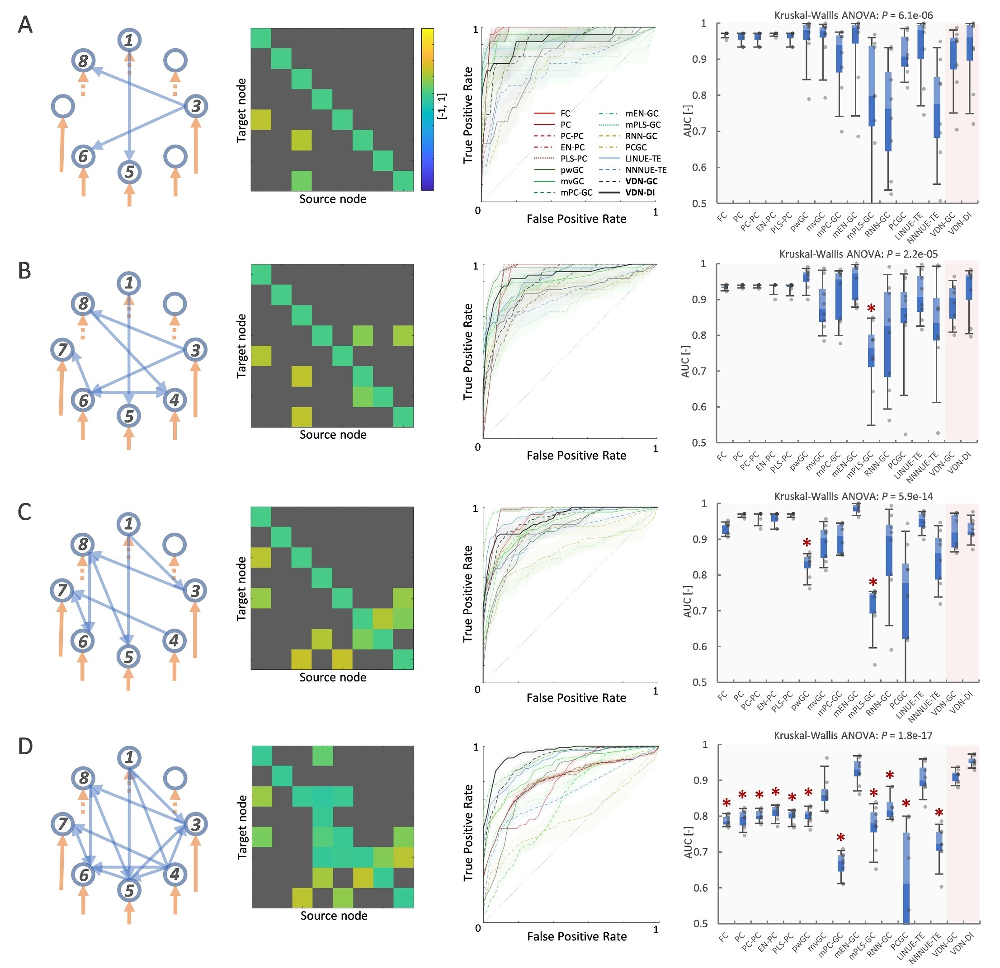
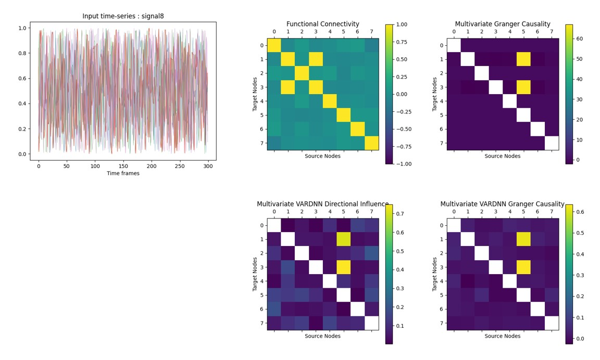
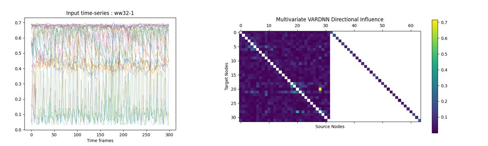
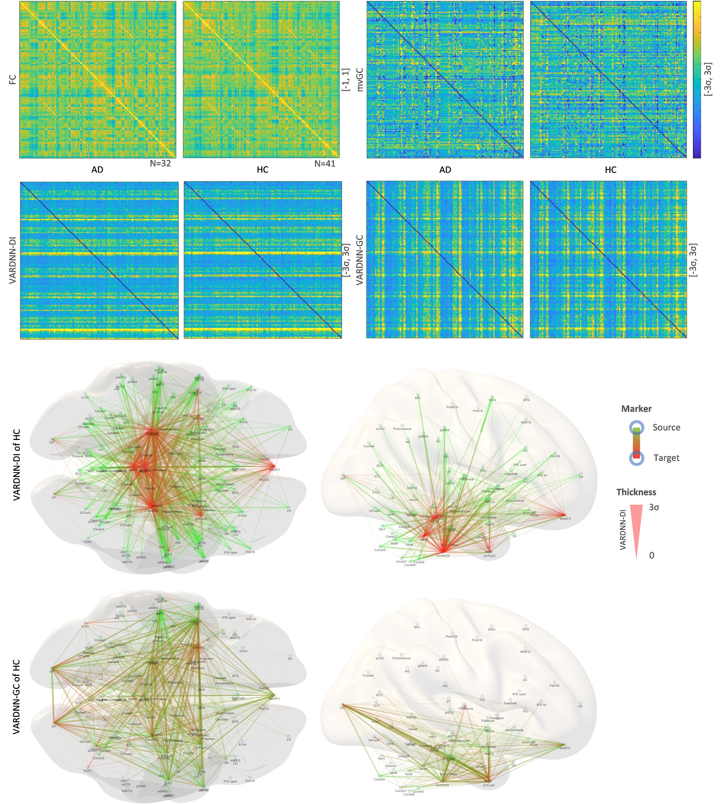

# Vector Auto-Regressive Deep Neural Network (VARDNN) Toolbox for Python

## Introduction
VARDNN is a powerful tool of data-driven analysis technique to estimate directed FC (Functional Connectivity).
Based on VARDNN framework, two types of directed FC are defined, such as VARDNN-DI and VARDNN-GC to measure causal relation among multiple time-series data.

This toolbox includes several functional connectome measures, such as VARDNN-DI, VARDNN-GC, multivariate Granger Causality (GC), pairwise GC,
multivariate Principal Component (PC)-GC, Functional Connectivity (Correlation), Partial Correlation to estimate conectivity from multiple node signals.

Command line tool could perform conectivity estimation with several functional connectome measures from node time-series in csv or mat file,
then show output of causal relational matrix and save data in csv or mat file.
Matlab version is [here](https://github.com/takuto-okuno-riken/vardnn).

## Requirements: software
* Python 3.9.*
* matplotlib 3.5.*
* scikit_learn 1.1.*
* tensorflow 2.9.*
* pandas 1.4.*

## Installation
1. Download this [Toolbox](https://github.com/takuto-okuno-riken/vardnnpy/archive/refs/heads/main.zip) zip files.
2. Extract zip file under your working directory <work_path>/vardnnpy-main.
3. This is not required, but we recommend using the conda virtual environment.
~~~
(base) work_path>cd vardnnpy-main
(base) vardnnpy-main>conda create -n vardnn python=3.9
...
(base) vardnnpy-main>conda activate vardnn
(vardnn) vardnnpy-main>
~~~
4. Install several packages.
~~~
(vardnn) vardnnpy-main>pip install matplotlib==3.5
...
(vardnn) vardnnpy-main>pip install scikit-learn==1.1
...
(vardnn) vardnnpy-main>pip install pandas==1.4
...
(vardnn) vardnnpy-main>pip install tensorflow==2.9
...
~~~
5. Run the following demos.

## Command line tool Demo
This demo inputs 8 nodes random signal and outputs FC, mvGC, VARDNN-GC and VARDNN-DI results csv files and matrix graphs.
(Copy and paste this command line. Demo data is included in VARDNN Toolbox.)
~~~
(vardnn) vardnnpy-main>python vardnn.py --fc --mvgc --vddi --vdgc --showsig --showmat --transform 1 --epoch 100 data/signal8.csv
...
loading signals : data/signal8.csv
saving matrix : results\signal8_fc.csv
saving matrix : results\signal8_mvgc.csv
training node 0
training node 1
training node 2
training node 3
training node 4
training node 5
training node 6
training node 7
saving matrix : results\signal8_vddi.csv
saving matrix : results\signal8_vdgc.csv
Press Enter to exit...
~~~
These are output graphs of vardnn command.

___
VARDNN can take exogenous input signals with control matrix.
~~~
(vardnn) vardnnpy-main>python vardnn.py --vddi --vdgc --showmat --epoch 100 --transform 1 --nocache --ex data/signal8ex.csv --ectrl data/ctrleye.csv data/signal8.csv
...
loading signals : data/signal8.csv
loading ex signals : data/signal8ex.csv
loading ex control : data/ctrleye.csv
training node 0
training node 1
training node 2
training node 3
training node 4
training node 5
training node 6
training node 7
saving matrix : results\signal8_vddi.csv
...
saving matrix : results\signal8_vdgc.csv
Press Enter to exit...
~~~
___
This demo inputs 32 nodes synthetic neural activity signals of .mat file and outputs VARDNN-DI results.
Result matrices of directed FC is saved in ww32-1_&lt;algorithm&gt;_all.mat file.
~~~
(vardnn) vardnnpy-main>python vardnn.py --vddi --transform 1 --lag 3 --epoch 500 --l2 0.1 --format 2 --showsig --showmat data/ww32-1.mat
loading signals : data/ww32-1.mat
...
saving matrix : results\ww32-1_vddi_all.mat
Press Enter to exit...
~~~
.mat file includes input data matrices.
| name | matrix | description |
|:---|:---|:---|
|X |&lt;nodes&gt; x &lt;length&gt;(double)|node signals|
|exSignal|&lt;exogenous nodes&gt; x &lt;length&gt;(double)|exogenous signals|
|nodeControl|&lt;nodes&gt; x &lt;nodes&gt;(logical)|node connection control matrix|
|exControl|&lt;nodes&gt; x &lt;exogenous nodes&gt;(logical)|exogenous node connection control matrix|
|groundTruth|&lt;nodes&gt; x &lt;nodes&gt;(logical)|ground truth of network connection for ROC curve|

Several graphs (node signals, result matrix) of each algorithm are shown by vardnn command.

## Command line tool
~~~
(vardnn) vardnnpy-main>python vardnn.py -h
usage: vardnn.py [-h] [--vddi] [--vdgc] [--mvgc] [--pwgc] [--fc] [--pc] [--outpath OUTPATH] [--format FORMAT]
                 [--transform TRANSFORM] [--transopt TRANSOPT] [--lag LAG] [--ex EX] [--nctrl NCTRL] [--ectrl ECTRL]
                 [--epoch EPOCH] [--l2 L2] [--showsig] [--showex] [--showmat] [--nocache]
                 filename [filename ...]

positional arguments:
  filename              filename of node status time-series (node x frames)

optional arguments:
  -h, --help            show this help message and exit
  --vddi                output VARDNN Directional Influence matrix result (<filename>_vddi.csv)
  --vdgc                output VARDNN Granger Causality matrix result (<filename>_vdgc.csv)
  --mvgc                output multivaliate Granger Causality matrix result (<filename>_mvgc.csv)
  --pwgc                output pairwise Granger Causality matrix result (<filename>_pwgc.csv)
  --fc                  output Correlation matrix result (<filename>_fc.csv)
  --pc                  output Partial Correlation matrix result (<filename>_pc.csv)
  --outpath OUTPATH     output files path (default:"results")
  --format FORMAT       save file format <type> 0:csv, 1:mat(each), 2:mat(all) (default:0)
  --transform TRANSFORM
                        input signal transform 0:raw, 1:sigmoid (default:0)
  --transopt TRANSOPT   signal transform option (for type 1:centroid value)
  --lag LAG             time lag for mvGC, pwGC (default:3)
  --ex EX               VARDNN exogenous input signal <files> (file1.csv[:file2.csv:...])
  --nctrl NCTRL         VARDNN node status control <files> (file1.csv[:file2.csv:...])
  --ectrl ECTRL         VARDNN exogenous input control <files> (file1.csv[:file2.csv:...])
  --epoch EPOCH         VARDNN training epoch number (default:500)
  --l2 L2               VARDNN training L2Regularization (default:0.05)
  --showsig             show node status signals of <filename>.csv
  --showex              show exogenous input signals of <file1>.csv
  --showmat             show result matrix of VARDNN-DI, VARDNN-GC, mvGC, pwGC, FC and PC
  --nocache             do not use cache file for VARDNN training
~~~

## Example Results
Example results of causal relation matrix graphs of human fMRI signals (132 ROI).
(Generating brain connectome image is not included in vardnn command)

## Citing VARDNN Toolbox
If you find VARDNN useful in your research, please consider citing:  
Takuto Okuno, Alexander Woodward,
["Vector Auto-Regressive Deep Neural Network: A Data-Driven Deep Learning-Based Directed Functional Connectivity Estimation Toolbox"](https://www.frontiersin.org/articles/10.3389/fnins.2021.764796/full), Front. Neurosci. 15:764796. doi: 10.3389/fnins.2021.764796

